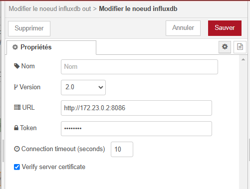
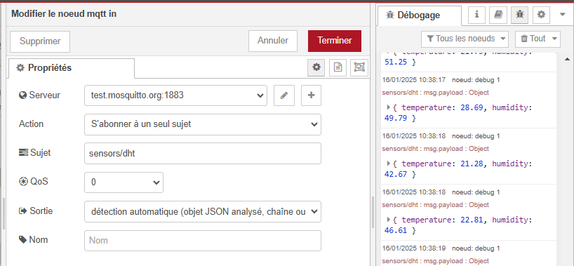
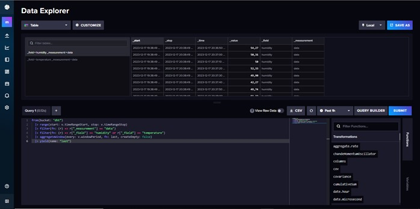

# Gestion des Conteneurs IoT via Docker

Ce projet illustre la gestion des données IoT à l'aide de conteneurs Docker et d'outils tels que Node-Red, Grafana et InfluxDB. Il simule un capteur DHT qui envoie des données de température et d'humidité, visualisées dans des tableaux de bord Grafana.

---

## Prérequis

Assurez-vous d'avoir les outils suivants installés sur la machine :
- Docker
- Python 3.x
- Bibliothèques MQTT (ex : `paho-mqtt`)

---

## Aperçu du Projet

L'architecture implique :
1. Un script Python simulant un capteur DHT.
2. Un broker MQTT (Eclipse-Mosquitto) pour la communication.
3. Node-Red pour le traitement et le stockage des données.
4. InfluxDB comme base de données pour séries temporelles.
5. Grafana pour la visualisation des données.

---

## Guide Étape par Étape

### 1. Simulation du Capteur DHT
- Un script Python est utilisé pour simuler les données de température et d'humidité et les publier sur un topic MQTT à l'aide de `paho-mqtt`.


---

### 2. Mise en Place du Broker MQTT (Eclipse-Mosquitto)
1. Exécutez le broker Mosquitto dans un conteneur Docker :
   ```bash
   docker run -d --name mosquitto -p 1883:1883 eclipse-mosquitto
   ```

2. Testez le broker en publiant et en souscrivant à un topic de test :
   ```bash
   mosquitto_pub -h localhost -t "test" -m "Bonjour MQTT"
   mosquitto_sub -h localhost -t "test"
   ```

---

### 3. Configuration de Node-Red
1. Exécutez Node-Red dans Docker :
   ```bash
   docker run -d --name node-red -p 1880:1880 nodered/node-red
   ```

2. Créez un flux dans Node-Red :

   

   - Ajoutez un nœud d'entrée MQTT pour recevoir des données du topic `dht/data`.
   - Ajoutez un nœud de sortie InfluxDB pour stocker les données dans la base `dht`.

   
   

   - Connectez les nœuds dans un flux.

   

3. Déployez le flux pour commencer le traitement des données.

---

### 4. Mise en Place d'InfluxDB
1. Exécutez InfluxDB dans Docker :
   ```bash
   docker run -d --name influxdb -p 8086:8086 influxdb
   ```

2. Créez une nouvelle base de données :
   - Accédez au shell InfluxDB :
     ```bash
     docker exec -it influxdb influx
     ```
   - Créez la base de données `dht` :
     ```sql
     CREATE DATABASE dht;
     ```
   
   
   
   

3. Vérifiez la création de la base de données :
   ```sql
   SHOW DATABASES;
   ```
---

### 5. Configuration de Grafana
1. Exécutez Grafana dans Docker :
   ```bash
   docker run -d --name grafana -p 3000:3000 grafana/grafana
   ```

2. Configurez une source de données :
   - Connectez-vous à Grafana via `http://localhost:3000` (identifiants par défaut : `admin`/`admin`).

   

   - Allez dans **Configuration > Data Sources**.
   - Ajoutez une nouvelle source de données :
     - Type : **InfluxDB**

     
     

     - URL : `http://influxdb:8086`
     - Base de données : `dht`

3. Créez un tableau de bord :
   - Ajoutez un nouveau tableau de bord.
   - Ajoutez des panneaux pour visualiser les données de température et d'humidité.
   - Configurez les requêtes pour récupérer les données de la base `dht`.

---
### 6. démarrage des conteneurs


## Captures d'Écran
- **Visualisation des données avec Grafana :**


  

---

## Dépannage
- Si les services ne démarrent pas, vérifiez les journaux des conteneurs Docker :
  ```bash
  docker logs <nom_du_conteneur>
  ```
- Assurez-vous que tous les ports requis (1883, 1880, 8086, 3000) sont ouverts et accessibles.
- Vérifiez la connexion entre les services via leurs interfaces ou journaux respectifs.

---
